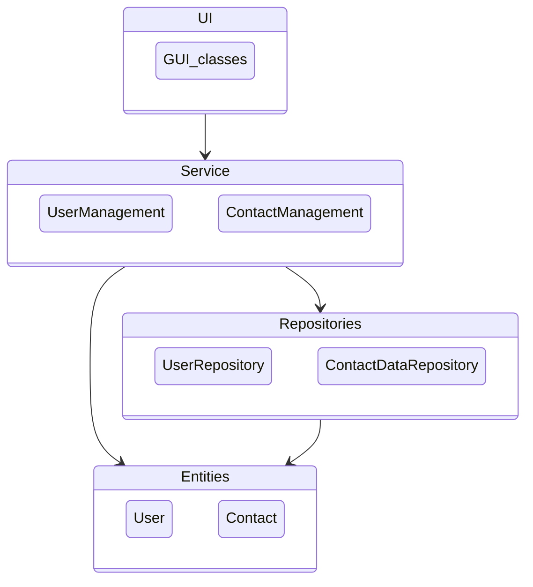
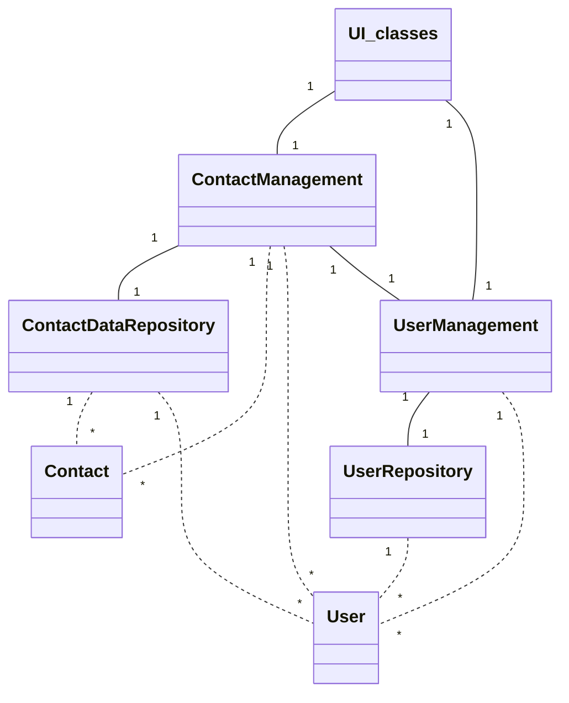
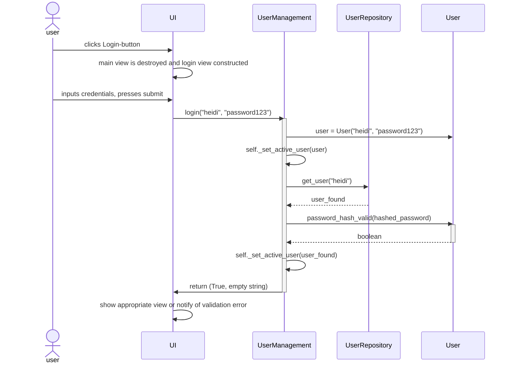
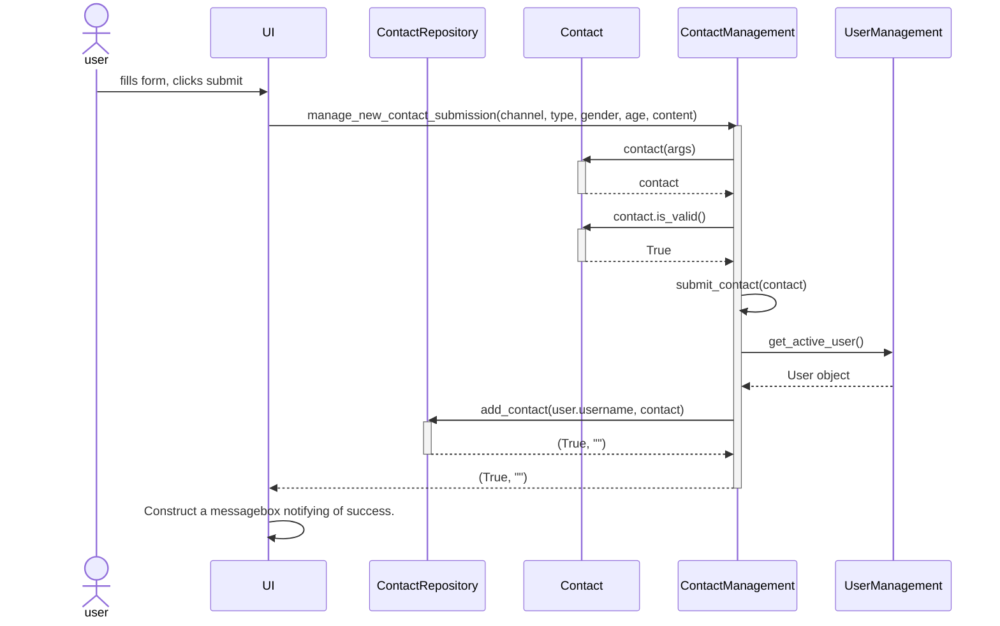
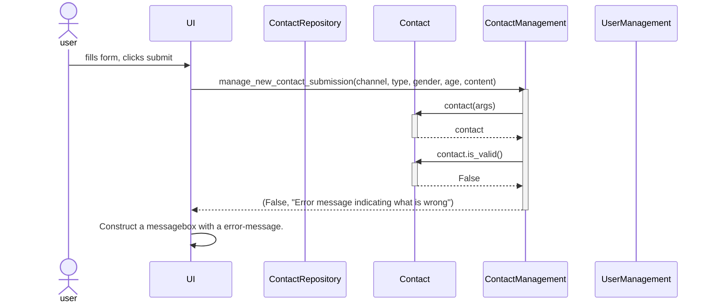
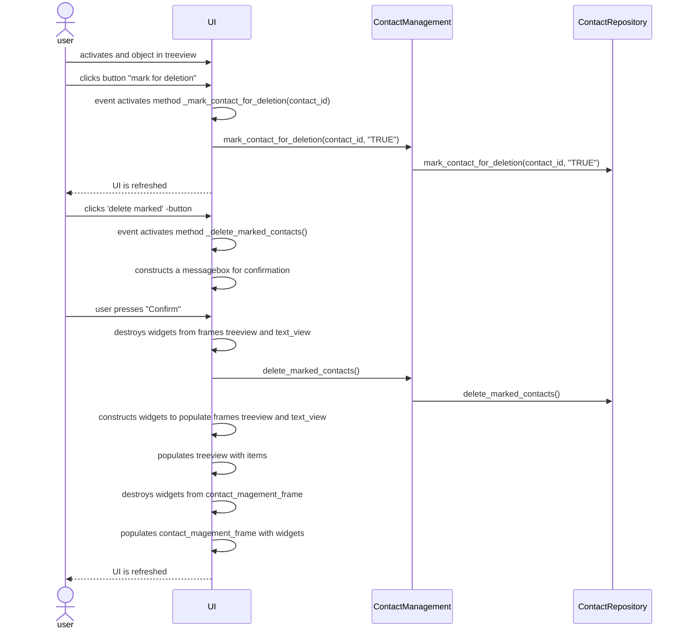

# Architecture

## Structure
The structure of the application follows the layered architecture framework.  

* The package UI includes the classes used to create objects that construct the graphical user interface views and it's interactive functionalities. 
* The package Service works as a hub controlling the logic of the application. 
* Package Entities contains the objects that contain the different data structures used by the application. 
* The package Repositories handles the database queries (retrieving and storing data).

## Class diagram

Below is a visualization of the class diagram and dependencies. The application uses default object instances of service and repository classes. UI-classes 'remember' the instances of service classes they use and the service classes 'remember' the instances of repository class objects used. None of the GUI, service or repository classes 'remember' instances from the entities classes, even if many of them use them temporarily. Exception being the active user that is referenced in the service class UserManagement. 

## Main functionalities

We will next showcase the application logic through examples of few main functionalities.

### Login
When user enters the main view and sets to log in, the following chain of events is carried out:

### Submit contact data
When user fills the data submission form and submits new data, the following chain of actions is carried out in the case of valid submission:

Incase the validation fails (for instance a counseling contact is missing required data) the following sequence takes place:

### Mark contact data for deletion
Users with role admin can preview data submission, mark them for deletion and delete marked submission. The next sequence diagram showcases the chain of events that is carried out when a user first marks an item for deletion and then deletes marked items. This sequence diagram has more internal logic of GUI object instance described to give an understanding on the logic GUI classes have been constructed with. 

