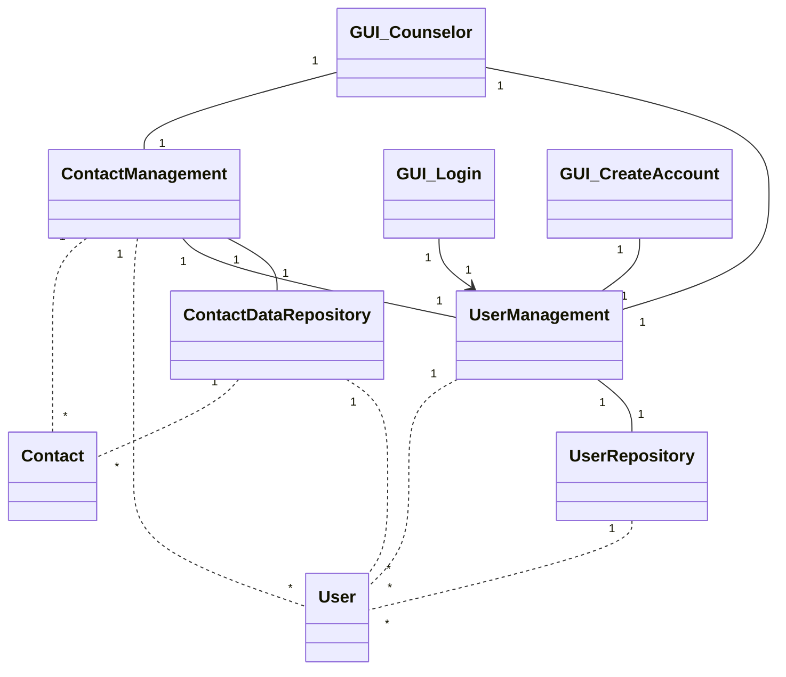

# Architecture

## Structure
The structure of the application follows the layered architecture framework. At the current initial stage the structure has open issues that will be fixed in the future. For instance in the next phase the goal is to disconnet UI from the Entities-package. 

The package UI includes the classes responsible for the objects that create the graphical user interface and it's functionalities. The package Service works as a hub controlling the logic of the application. 

Package Entities contains the objects that contain the different data structures used by the application. The package Repositories handles the database queries (retrieving and storing data).

## Class diagram

Below is a visualization of the current class diagram and dependencies. The vision is to make refactor the code in week 5 to make the dependencies more structured. Feedback and tips on how to work towards this are very welcome!

At the time being the application uses one object instance of the classes in UI, service and repository classes. UI-classes 'remember' the service classes they use and the service classes 'remember' the repositories used. None of the GUI, service or repository classes 'remember' objects from the entities classes, even if many of them use them temporarily. 

