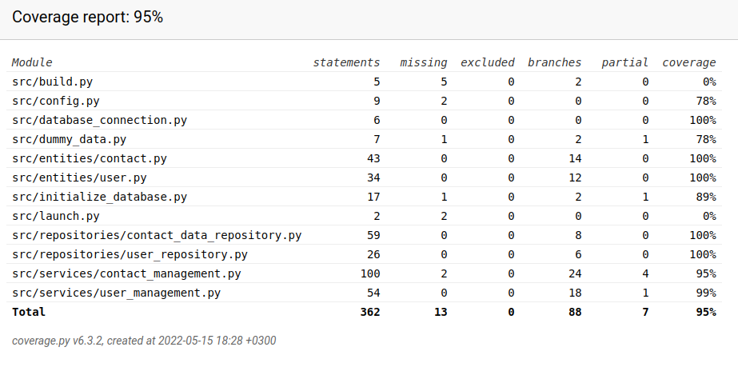

# Testing documentation

The application has been tested both with automated unit and integration tests and with manual system tests. 

## Unit and integration tests

### Application logic
The application logic is handled by instances of classes `ContactManagement` and `UserManagement` in package `Services`. The tests for service classes can be found from classes [TestContactManagement](https://github.com/heidi-holappa/ot-harjoitustyo/blob/master/src/tests/contact_test.py) and [TestUserManagement](https://github.com/heidi-holappa/ot-harjoitustyo/blob/master/src/tests/user_test.py). In both classes the objects are setup so that instances of repository class objects are injected to them. Tests are configured to use test database during tests. The database is initialized before each test. 

### Reposiotry classes
Repository classes `ContactDataRepository` and `UserRepository` are tested by using a test database created each time a test is run. The name of the test database is configured into the .env.test -file. `ContactDataRepository` is tested with the class [TestContactRepository](https://github.com/heidi-holappa/ot-harjoitustyo/blob/master/src/tests/contact_repository_test.py) and `UserRepository` is tested with the class [TestUserRepository](https://github.com/heidi-holappa/ot-harjoitustyo/blob/master/src/tests/user_repository_test.py).

### Test coverage
Excluding the UI-package the branch coverage rate is 95 percent

The files launch.py and build.py were excluded from testing. These could've been excluded from the branch coverage. 

## System testing

The system testing was carried out manually. Two volunteer peer-students participated in the testing process and provided valuable feedback. The application has been tested with at least three different computers and in the university virtual environment. 

### Installation and configuration
The application has been downloaded and installed by following the project documentation by both cloning the project and by donwloading a release. All installations have been made on Linux-based computers due to the limited access to MacOS-systems. 

Application has been tested both in situations where stored data exists and where a fresh install is launched. 

### Functionalities
All functionalities listed in the [requirements specification](requirements-specification.md) have been tested. With all interactive fields invalid submissions (or lack of submissions) have been tried out. 

## Existing quality issues
* The error message is not user fiendly when the project is not initialized with the command 'poetry run invoke build.'
* Exception handling in the application logic could be improved by using tailored exceptions
* In the contact preview text-widget text layout has spacing issues. 
* Contact preview window does not have a scrollbar. Content can be scrolled with a mouse wheel or by selecting content.
* The counselor view is not as intuitive as it could be. Instructive texts could be added to guide users on what fields to fill in different situations. 
