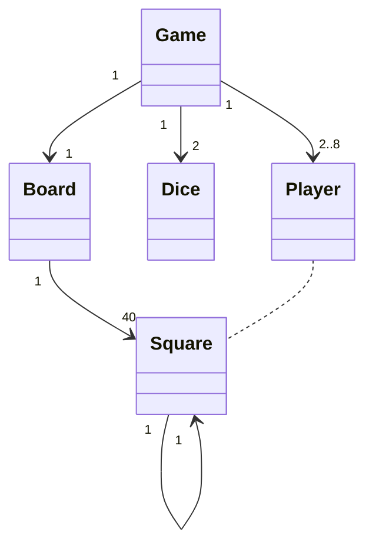

# Task 1 - Monopoly class diagram - part 1

```mermaid
 classDiagram
      Game "1" --> "2..8" Player
      Game "1" --> "2" Dice
      Game "1" --> "1" Board      
      Board "1" --> "40" Square
      Player  ..  Square
      Square "1" --> "1" Square
      class Game{         

      }
      class Board{
    
      }
      class Player{

      }
      class Dice{

      }
      class Square{

      }
```