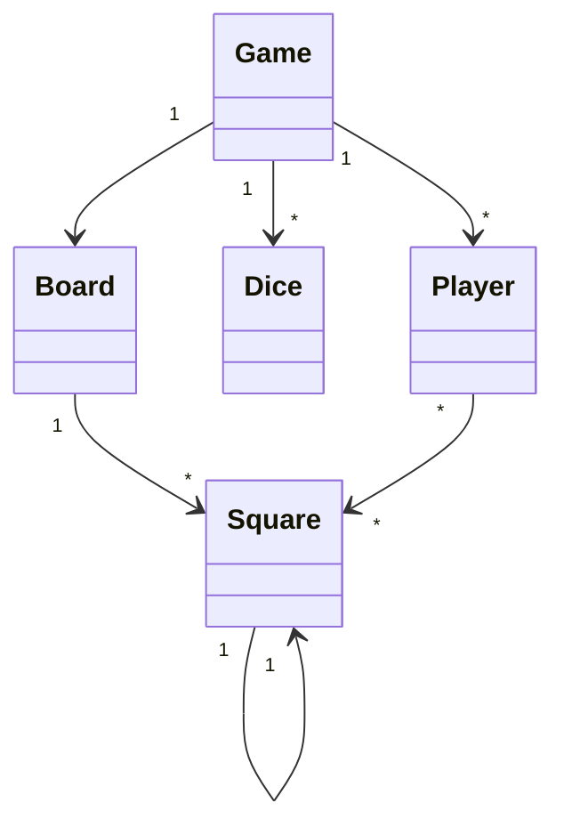

```mermaid
 classDiagram
      Game "1" --> "*" Player
      Game "1" --> "*" Dice
      Game "1" --> Board      
      Board "1" --> "*" Square
      Player "*" --> "*" Square
      Square "1" --> "1" Square
      class Game{         

      }
      class Board{
    
      }
      class Player{

      }
      class Dice{

      }
      class Square{

      }
```