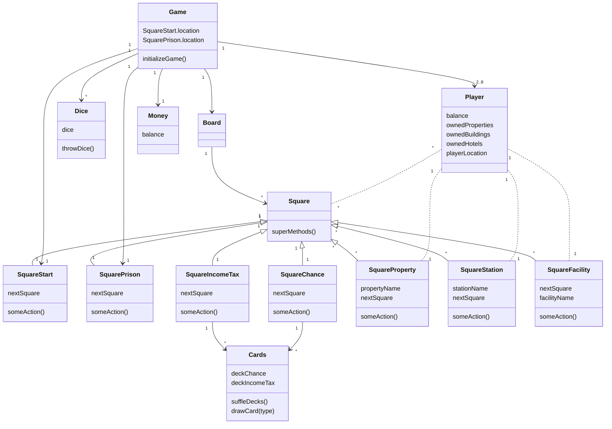

# Task 2 - Monopoly class diagram - part 2
**Note:** this file is intended for personal learning and should not be reviewed as a part of the weekly tasks. I wanted to experiment on how the diagram would form, if I used more attributes and some methods. I also practiced using a different syntax (more pythonic, perhaps) in mermaid. 

As a novice it was my experience, that for now it is easier to visualize an idea for an application from a diagram with more details. I assume that with experience and skills the benefits of a more abstract diagram become more apparent. 

