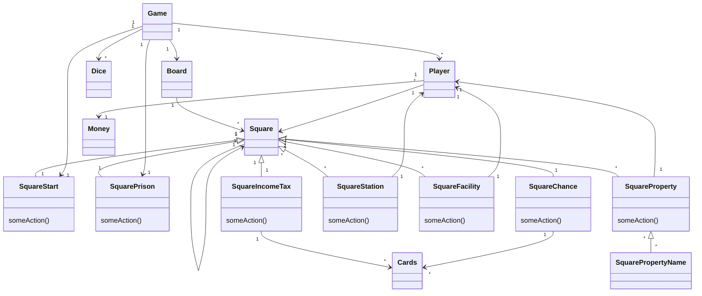

```mermaid
 classDiagram
     
      class Game{         

      }
      class Board{
    
      }
      class Dice{

      }
      class Player{

      }
      
      class Square{

      }

      class Money{

      }

      Game "1" --> "*" Player
      Game "1" --> "*" Dice
      Game "1" --> Board      
      Board "1" --> "*" Square
      Player "*" --> "*" Square
      Square "1" --> "1" Square
      Player "1" --> "1" Money

      Square "1" <|-- "1" SquareStart
      Square "1" <|-- "1" SquarePrison
      Square "1" <|-- "1" SquareChance
      Square "1" <|-- "1" SquareIncomeTax
      Square "*" <|-- "*" SquareProperty
      Square "*" <|-- "*" SquareStation
      Square "*" <|-- "*" SquareFacility
      SquareProperty "*" <|-- "*" SquarePropertyName
      Game "1" --> "1" SquarePrison
      Game "1" --> "1" SquareStart
      class SquareStart{
          someAction()
      }
      class SquarePrison{
          someAction()
      }
      class SquareChance{
          someAction()
      }
      class SquareIncomeTax{
          someAction()
      }
      class SquareProperty{
          someAction()
      }
      class SquareStation{
          someAction()
      }
      class SquareFacility{
          someAction()
      }
      class SquarePropertyName{

      }
      SquareProperty "1" --> "1" Player
      SquareFacility "1" --> "1" Player
      SquareStation "1" --> "1" Player

      SquareIncomeTax "1" --> "*" Cards
      SquareChance "1" --> "*" Cards

      class Cards{

      }
```