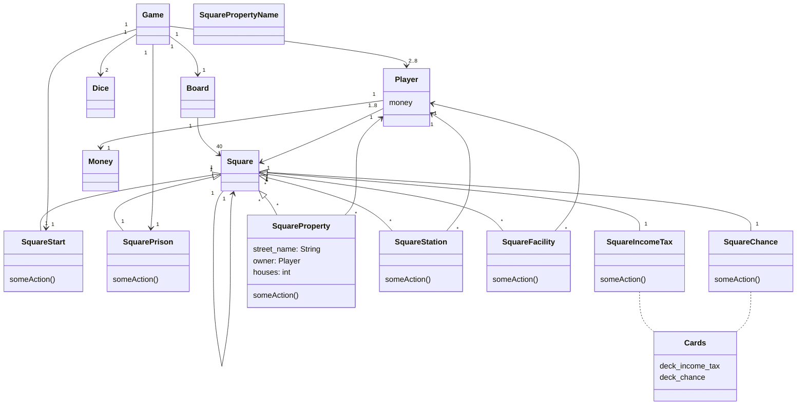

# Task 2 - Monopoly class diagram - part 2

## Description
This is a class diagram for monopoly done as a course assignment. The diagram portrays the following features: 
- monopoly is played using two dices
- game has from 2 to 8 players
- game is played on one board
- the board has 40 squares
- each square 'knows' what is the next square
- each player has one character token
- player token is always in one of the squares
- there are different types of squares:
  - start square
  - prison
  - chance and income tax
  - stations and facilities
  - normal streets (with a unique name)
- Monopoly game 'knows' the location of the start square and the prison square
- each square has some action
- chance and income tax squares have cards. Each card has some action
  - there are different types of actions. These are not to be detailed at this time. 
- four (4) houses or one hotel can be built on regular streets
- one of the players can own a particular street
- players have money

## Notes on the execution
- class Cards has two decks and manages all actions related to cards. 
- class Square has different types of squares as subclasses. 
- certain squares can have an owner. The owner information is stored in the square
- initial idea is to have hotel to be represented by the attribute house (perhaps with a value 5). This way we do not need a different attribute for the hotel. 
- it is assumed that multiple player tokens can be in the same square. There can thus be from 1 to 8 player tokens in a square at one moment of the game. 