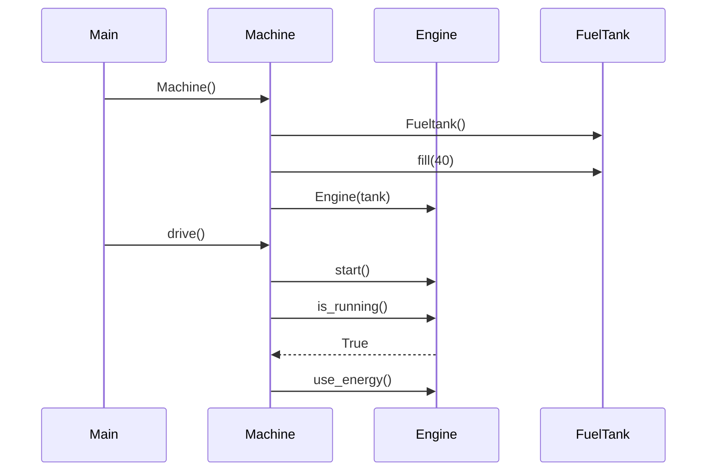

```mermaid
sequenceDiagram
  participant Main
  participant Machine
  participant Engine
  participant FuelTank
  Main->>Machine: Machine()
  Machine->>FuelTank: Fueltank()
  Machine->>FuelTank: fill(40)
  Machine->>Engine: Engine(tank)
  Main->>Machine: drive()
  Machine->>Engine: start()
  Machine->>Engine: is_running()
  Engine-->>Machine: True
  Machine->>Engine: use_energy()
```