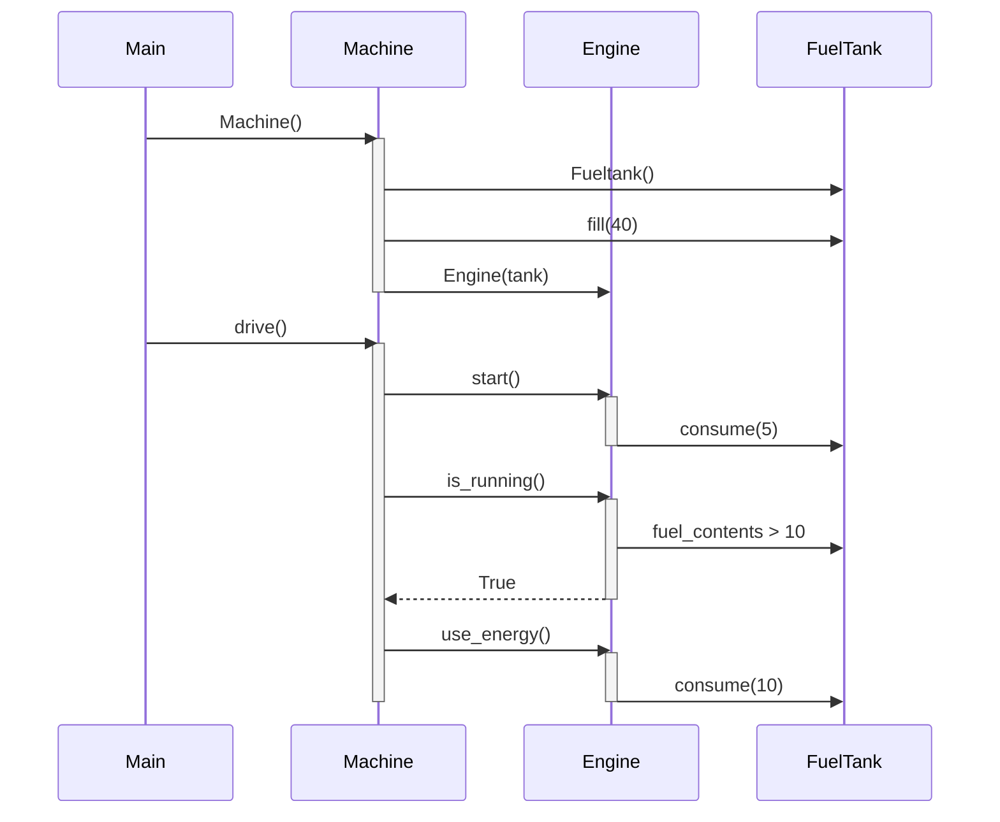

# Week 3 - Task 3: Sequence Diagram - Machine

```mermaid
sequenceDiagram
  participant Main
  participant Machine
  participant Engine
  participant FuelTank
  Main->>Machine: Machine()
  activate Machine
  Machine->>FuelTank: Fueltank()
  Machine->>FuelTank: fill(40)
  Machine->>Engine: Engine(tank)
  deactivate Machine
  Main->>Machine: drive()
  activate Machine
  Machine->>Engine: start()
  activate Engine
  Engine ->> FuelTank: consume(5)
  deactivate Engine
  Machine->>Engine: is_running()
  activate Engine
  Engine->>FuelTank: fuel_contents > 10
  Engine-->>Machine: True
  deactivate Engine
  Machine->>Engine: use_energy()
  activate Engine
  Engine->>FuelTank: consume(10)
  deactivate Engine
  deactivate Machine
```