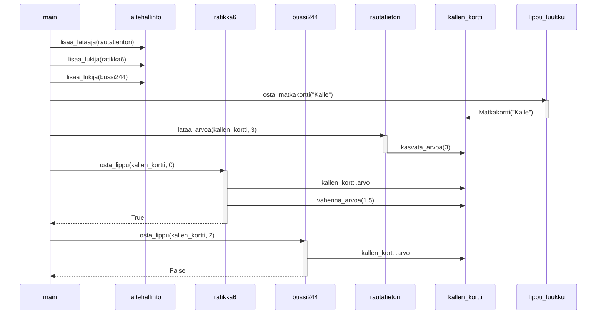

# Week 3 - Task 4: Sequence Diagram

## Comments
Based on the example in the course material I made the assumption that it is not necessary to include the creation of objects and their classes to the sequence diagram. I personally think they could be beneficial for easier reading in some cases, but in this case it is easy to see from the methods called what classes different objects represent. 

One this I struggled with were the conditions in methods. For example in the method call *osta_lippu(kallen_kortti, 0)* a conditional check is done to see if there is enough balance to buy a ticked. I made the decision to include the check for the balance (*kallen_kortti.arvo*) and the method call that followed from the condition being true and the return of value **True** to the main.
