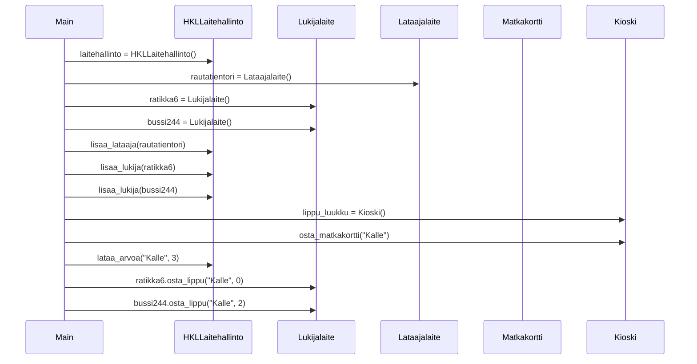

```mermaid
sequenceDiagram
  participant Main
  participant HKLLaitehallinto
  participant Lukijalaite
  participant Lataajalaite
  participant Matkakortti
  participant Kioski
  Main->>HKLLaitehallinto: laitehallinto = HKLLaitehallinto()
  Main->>Lataajalaite:  rautatientori = Lataajalaite()
  Main->>Lukijalaite: ratikka6 = Lukijalaite()
  Main->>Lukijalaite: bussi244 = Lukijalaite()
  Main->>HKLLaitehallinto: lisaa_lataaja(rautatientori)
  Main->>HKLLaitehallinto: lisaa_lukija(ratikka6)
  Main->>HKLLaitehallinto: lisaa_lukija(bussi244)
  Main->>Kioski: lippu_luukku = Kioski()
  Main->>Kioski: osta_matkakortti("Kalle")
  Main->>HKLLaitehallinto: lataa_arvoa("Kalle", 3)
  Main->>Lukijalaite: ratikka6.osta_lippu("Kalle", 0)
  Main->>Lukijalaite: bussi244.osta_lippu("Kalle", 2)
```